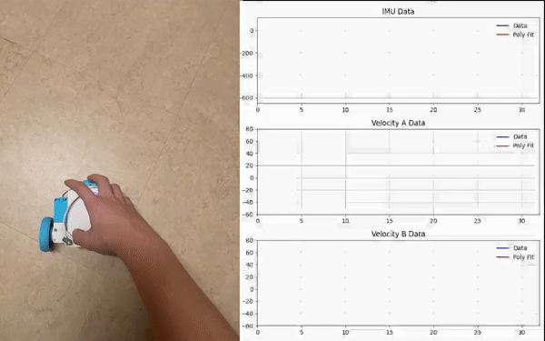
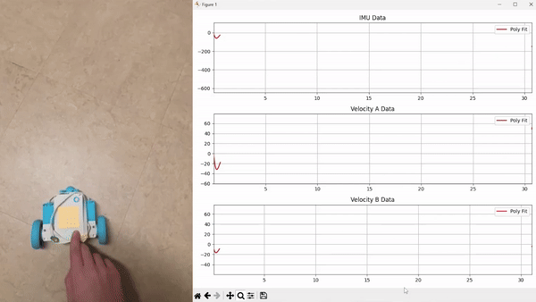

# Documentation for AI Path-Following Robot

## Introduction

This document provides an overview of an AI robot built using the LEGO SPIKE Prime platform. The robot consists of two motor-driven wheels with encoders and a supporting ball, enabling free movement. The robot’s key feature is its ability to retake the same path it learned during a teaching phase without memorizing every point in the path. Instead, the robot uses machine learning to generalize the movement and replicate the path effectively.

Two solutions were developed to achieve this functionality:
1. **Polynomial Regression**, which offers simplicity and computational efficiency.
2. **Neural Network Regression**, which uses a more complex model to capture trends in the data.

## System Design

To collect training data, the user simply moves the robot around while keeping a button pressed. During this phase, the robot records:
1. Left wheel velocity over time.
2. Right wheel velocity over time.
3. IMU angle over time.

These data are recorded at a low refresh rate to reduce memory usage while maintaining sufficient granularity for training. The goal is to train a regression model on these graphs to understand the robot’s motion throughout the path rather than memorizing specific points.

## Solutions

### Solution 1: Polynomial Regression

#### Approach

The first solution utilized polynomial regression for its simplicity, computational efficiency, and ability to easily generalize a graph from key points. Polynomial regression smoothed the recorded data and allowed training directly on the LEGO SPIKE Prime hardware without requiring extensive computational resources.

#### Advantages

- Significantly faster training and inference compared to neural networks.
- Produced smoother and more accurate results during path-following tests.
- Fully compatible with MicroPython, avoiding the need for external libraries.

### Solution 2: Neural Network Regression

#### Approach

The second solution used a neural network based on Multi-Layer Perceptrons (MLPs) with ReLU activation functions. This architecture enabled the network to learn complex relationships between time and the recorded data. The neural network took time as an input and produced velocity or IMU angle as the output, effectively running regression on the recorded graphs. Through trial and error I determined that an optimal network structure would be one with two hidden layers both with 128 neurons and one output neuron representing the velocity of the motor. This is a diagram of the network arhitecture used

#### Challenges and Observations

The neural network regression faced significant challenges when implemented on the LEGO SPIKE Prime:
- The initial network size was too large (16640 neuron connections for each network) for the hardware limitations of the SPIKE Prime, leading to memory constraints.
- Transitioning the implementation to MicroPython, which lacks libraries like NumPy and PyTorch, resulted in extremely slow computation. Matrix multiplications performed in pure Python are too slow for the amount of edges in the network

To address these issues, the neural network was redesigned to use discrete outputs, significantly reducing computational requirements.

#### Discrete Neural Network Regression

By transitioning to discrete outputs, the neural network became a classifier rather than a regressor. The network categorized the input time into discrete steps and mapped these steps to corresponding velocities or IMU angles. The architecture was simplified to one input representing the time, a hidden layer with 20 nodes and an output layer of 20 nodes. Using discrete outputs means that every output node represents a certain velocity and after every run through the neural network we choose the velocity with the highest value in the output nodes. This arhitecture was determined through trial and error to be as small as possible to be able to run on the SPIKE while also achieving efficient regression. This is a diagram of the network arhitecture.

This approach provided the following advantages:
- Reduced the number of neurons and computational overhead with only 420 connections compared to 16640 with previous network (40 times less connections with similar regression results :)) )
- Improved memory efficiency, allowing the network to run on the SPIKE Prime hardware.

## Control Mechanism: PID Controller

For both solutions, a PID controller was implemented to maintain the IMU angle during path-following. This ensured improved stability and accuracy compared to relying solely on velocity following.

## Results

Comparison of the outputs of the discrete neural network and polynomial regression showed that while both methods successfully generalized the recorded data, polynomial regression provided a smoother and more efficient solution for the SPIKE Prime platform.

## Conclusion

This project demonstrates the potential of using machine learning for path-following tasks on resource-constrained platforms like the LEGO SPIKE Prime. Polynomial regression emerged as the optimal solution due to its simplicity, computational efficiency, and robust performance. Neural networks with discrete outputs offered significant improvements over continuous regression but were limited by hardware constraints.

